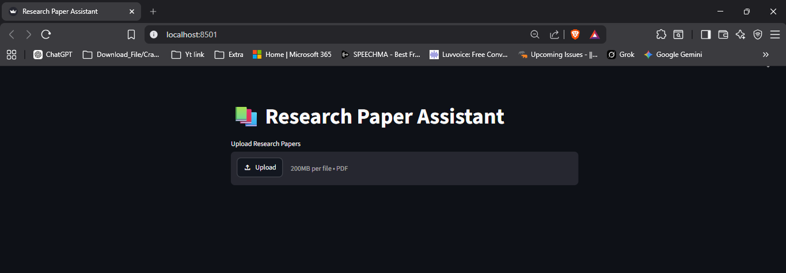
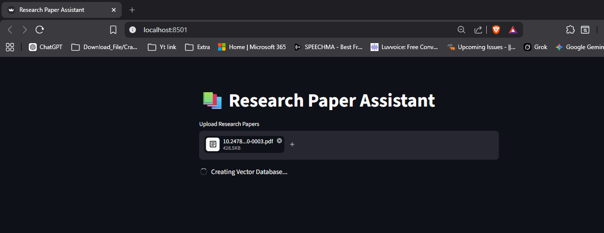
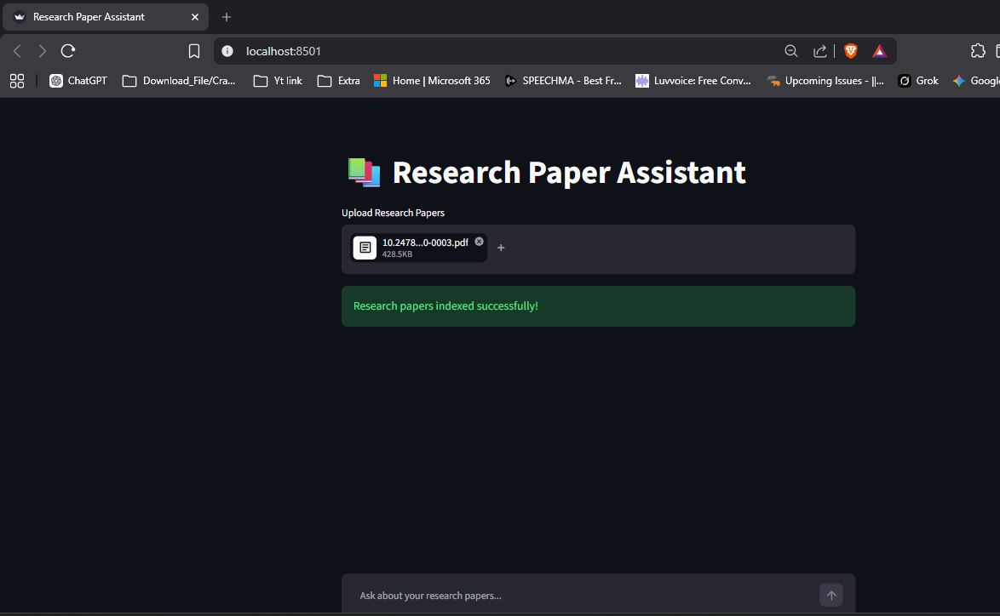
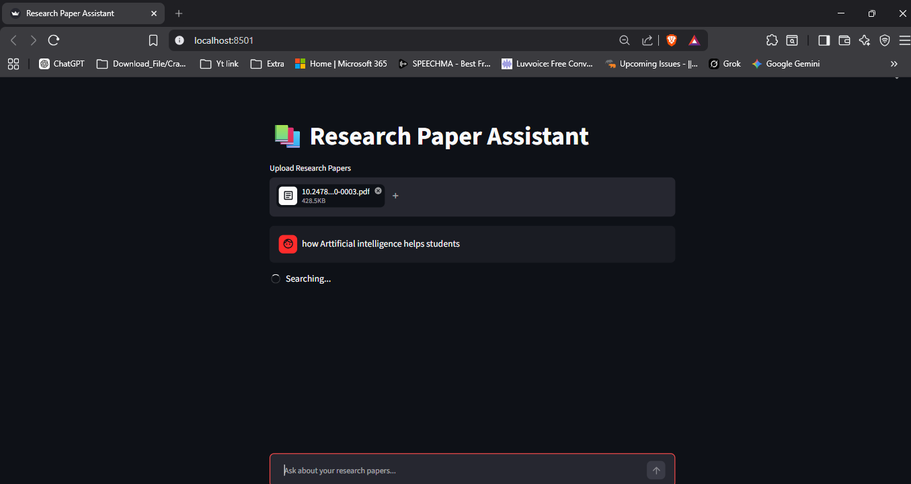
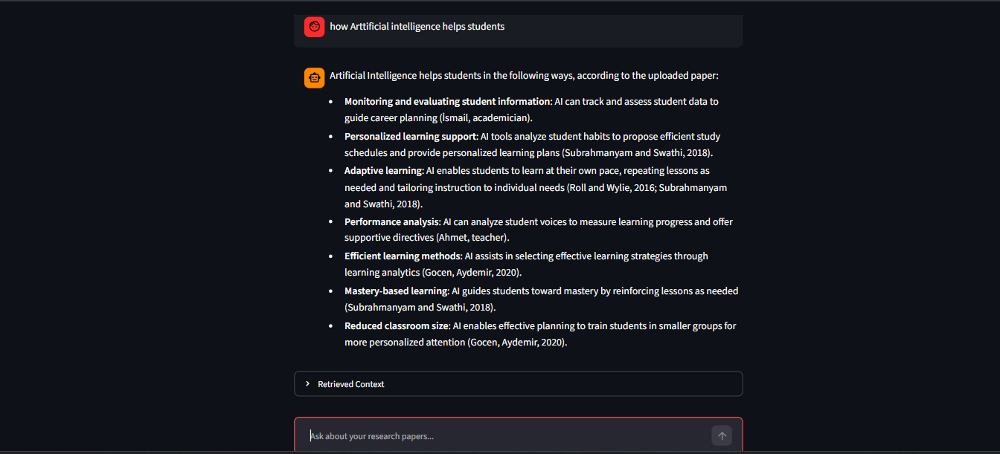
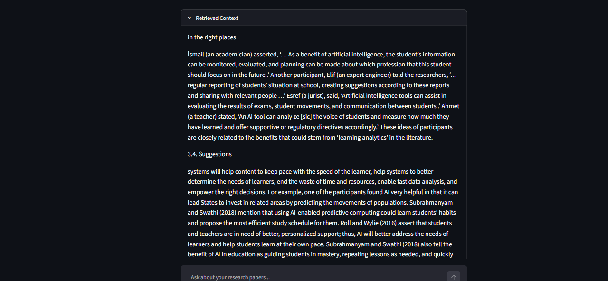

# 📚 Research Paper Assistant

An AI-powered RAG (Retrieval-Augmented Generation) chatbot that lets you upload research papers (PDFs) and ask questions about them. Built with LangChain, MistralAI, HuggingFace Embeddings, ChromaDB, and Streamlit.

---

## 🚀 Features

- Upload multiple research papers (PDFs) at once
- Automatically chunks and indexes papers into a vector database
- Ask natural language questions and get answers grounded in your papers
- Shows retrieved context so you can verify the source
- Powered by MistralAI LLM + HuggingFace embeddings (runs locally, no OpenAI needed)

---

## 📸 Screenshots

### 1. Upload Research Papers


### 2. Creating Vector Database


### 3. Papers Indexed Successfully


### 4. Asking a Question


### 5. AI Answer


### 6. Retrieved Context


## 🗂️ Project Structure

```
ResearchPaperAssistant/
├── app.py                 # Streamlit UI
├── main.py                # RAG assistant logic (LLM + retriever + prompt)
├── create_database.py     # PDF loader, chunker, and vector store creator
├── requirements.txt       # Python dependencies
├── .env                   # API keys (never commit this)
├── .gitignore
└── README.md
```

---

## ⚙️ Setup & Installation

### 1. Clone the repository

```bash
git clone https://github.com/shashwatpokharel27-dotcom/research-paper-assistant.git
```

### 2. Create and activate a virtual environment

```bash
python -m venv .venv

# Windows
.venv\Scripts\activate

# macOS / Linux
source .venv/bin/activate
```

### 3. Install dependencies

```bash
pip install -r requirements.txt
```

### 4. Set up your `.env` file

Create a `.env` file in the root folder:

```
MISTRAL_API_KEY=your_mistral_api_key_here
```

Get your key at [console.mistral.ai](https://console.mistral.ai)

---

## ▶️ Run the App

```bash
streamlit run app.py
```

Then open [http://localhost:8501](http://localhost:8501) in your browser.

---

## 🧠 How It Works

1. **Upload Research Papper(PDFs)** → loaded and split into 1000-character chunks (200 overlap)
2. **Embeddings** → chunks embedded using `BAAI/bge-small-en-v1.5` (HuggingFace)
3. **Vector Store** → stored in ChromaDB (in-memory per session)
4. **Query** → MMR retrieval fetches the top 4 most relevant chunks
5. **Answer** → MistralAI generates an answer strictly from retrieved context

---

## 🛠️ Tech Stack

| Tool | Purpose |
|------|---------|
| [Streamlit](https://streamlit.io) | UI |
| [LangChain](https://langchain.com) | RAG pipeline |
| [MistralAI](https://mistral.ai) | LLM (`mistral-small-2603`) |
| [HuggingFace](https://huggingface.co) | Embeddings (`BAAI/bge-small-en-v1.5`) |
| [ChromaDB](https://trychroma.com) | Vector store |
| [PyPDF](https://pypdf.readthedocs.io) | PDF loading |

---

## 📌 Notes

- The vector database is created fresh each session (in-memory). Re-upload your PDFs on each run.
- Make sure your Mistral API key has active credits.
- HuggingFace embeddings run locally — no extra API key needed.

---

## 📄 License

MIT License
